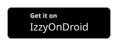
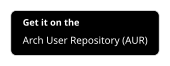

# OpenTodoList

OpenTodoList is a simple, open source app for keeping track of the things you
want to remember: tasks, notes, images, recipes, and the little bits of everyday
life that otherwise end up scattered everywhere.

It runs on phones, tablets, and desktop systems, and it is built around one
important idea: your data should stay yours.

[Get OpenTodoList](#get-opentodolist){ .md-button .md-button--primary }
[Read the manual](./basics/index.md){ .md-button }

{: width=260}
{: width=260}
{: width=260}

## A Place For The Lists You Actually Use

OpenTodoList helps you organize information in **libraries**. A library can hold
todo lists, notes, images, and recipes, so you can keep related things together
instead of splitting them across several apps.

Use it for shopping lists, project notes, household tasks, travel plans, meal
ideas, or whatever else needs a calm little home. Nothing about it forces you
into one particular workflow.

## Why People Choose OpenTodoList

- **Local-first by default.** You can keep a library only on your device.
- **File-based storage.** Libraries are stored as regular folders and files, so
  they are easy to back up and inspect.
- **Sync when you want it.** Synchronize libraries via Nextcloud, ownCloud,
  generic WebDAV servers, or Dropbox.
- **Useful item types.** Manage todo lists, tasks, notes, images, and recipes in
  one place.
- **Cross-platform.** Use it on Android, iOS, Linux, macOS, and Windows.
- **Open source.** The app is licensed under the GNU GPL and developed in the
  open.

## Stay In Control

Many productivity apps ask you to trust one specific service with everything.
OpenTodoList takes a different route.

You can create a fully local library, use your own Nextcloud or ownCloud server,
connect to another WebDAV storage provider, or sync a local library with a tool
you already trust. That makes the app especially useful when your notes and
tasks should not quietly wander off to a service you did not choose.

## Built For Everyday Devices

OpenTodoList is available for mobile and desktop systems:

- Android
- iOS
- Linux
- macOS
- Windows

Because it is built with Qt and released as open source software, adventurous
users can also build it for other systems.

## Get OpenTodoList

Choose the option that fits your device:

- **Android:** Install from
  [Google Play](https://play.google.com/store/apps/details?id=net.rpdev.opentodolist)
  or
  [IzzyOnDroid](https://apt.izzysoft.de/fdroid/index/apk/net.rpdev.opentodolist).
- **iOS:** Install from the
  [App Store](https://apps.apple.com/us/app/opentodolist/id1490013766).
- **Linux, macOS, and Windows:** Download packages from
  [GitHub Releases](https://github.com/mhoeher/opentodolist/releases).
- **Linux stores:** Install from
  [Flathub](https://flathub.org/apps/details/net.rpdev.OpenTodoList),
  [Snapcraft](https://snapcraft.io/opentodolist), or the
  [AUR](https://aur.archlinux.org/packages/opentodolist/).

[Installation details](./installation/index.md){ .md-button .md-button--primary }

## Learn More

- New to the app? Start with the [Basics](./basics/index.md).
- Want to understand libraries and item types? Read about the
  [data model](./basics/data_model/index.md).
- Setting up sync? Head to the [sync guide](./features/sync/index.md).
- Want to keep a copy of your data? See [Backup](./features/backup/index.md).

OpenTodoList is intentionally a little different from many modern productivity
apps. It gives you a useful place to organize your day, and then gets out of the
way. Honestly, that is the whole trick.
